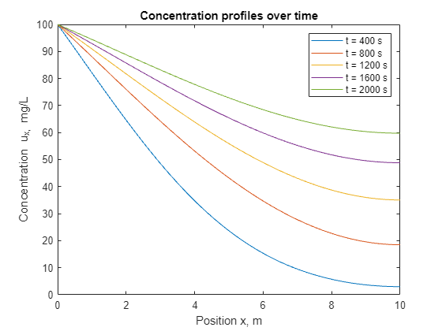
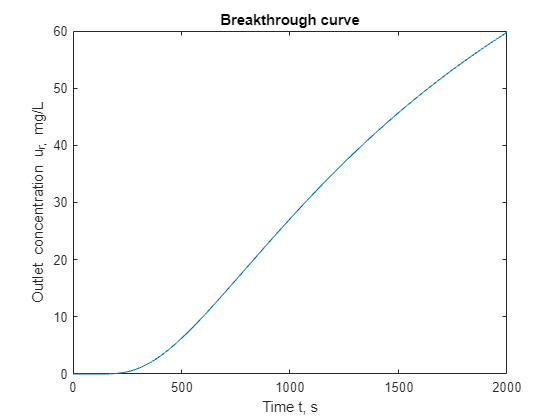

# Guide: 1D Advection Dispersion equation using pdepe in MATLAB

## Objective
The objective of this tutorial is to demonstrate the implementation of the Avection Dispersion equation (ADE) in one dimension in MATLAB using the [pdepe solver](https://www.mathworks.com/help/matlab/ref/pdepe.html).

This tutorial's concents are licensed under the MIT License, a free and open source license.

## Scenario: Constant inlet concentration

### Problem statement
Consider a fixed bed of length $`L=\,\textup{m}`$ with a constant inlet concentration $`C_{in}=100\,\textup{mg/L}`$. Initially, the bed contains no fluid. Fluid begins to flow into the bed with a velocity of $`v=1\times10^{-3}\,\textup{m/s}`$ and the dispersion coefficient is $`D=2\times 10^{-2}\,\textup{m}^2/\textup{s}`$.

### Formulating the problem
The Advection Dispersion equation (ADE) has the following form:

$$\frac{\partial C}{\partial t}=D\frac{\partial^2 C}{\partial x^2}-v\frac{\partial C}{\partial x}$$

The advection term, $-v\frac{\partial C}{\partial x}$, describes the bulk motion of the fluid along the length of the bed. In this term, $v$ is the velocity of the fluid, and $\frac{\partial C}{\partial x}$ is the rate of change in concentration with respect to the change in position along the bed.

The dispersion term, $D\frac{\partial^2 C}{\partial x^2}$, described the spreading out of the fluid throughout the bed. The $D\frac{\partial^2 C}{\partial x^2}$ term can be further broken down into a molecular diffusion term and a mechanical dispersion term, through this will not be addressed in this guide. $D$ is the dispersion coefficient. In a sense, the dispersion term slows down the advection of the fluid along the bed.

### Converting to the correct form for pdepe
MATLAB's [pdepe function](https://www.mathworks.com/help/matlab/ref/pdepe.html) allows one or multiple partial differential equations to be solved if they can be written in the following form (let $u$ be the concentration $C$ used in the ADE above):

$$c\left(x,t,u,\frac{\partial u}{\partial x}\right)\frac{\partial u}{\partial t}=x^{-m}\frac{\partial}{\partial x}\left(x^m f\left(x,t,u,\frac{\partial u}{\partial x}\right)\right)+s\left(x,t,u,\frac{\partial u}{\partial x}\right)$$

For our ADE,

$$m=0$$
$$c\left(x,t,u,\frac{\partial u}{\partial x}\right)=1$$
$$f\left(x,t,u,\frac{\partial u}{\partial x}\right)=D\frac{\partial u}{\partial x}-vu$$
$$s\left(x,t,u,\frac{\partial u}{\partial x}\right)=0$$

### Setting the initial condition
Since, in the problem statement, the bed initially contains no fluid, $u_0(x)=0$.

### Setting the inlet boundary condition
The inlet (left) and outlet (right) boundary conditions for pdepe take the form:

$$p(x,t,u)+q(x,t)f\left(x,t,u,\frac{\partial u}{\partial x}\right)=0$$

For the inlet, the concentration is constant: $`C_{in}=100\,\textup{mg/L}`$. Rewriting this:

$$u_l=100\rightarrow u_l-100=0$$

Converting this relation to the form required for pdepe,

$$p_l(x,t,u)=u_l-100$$
$$q_l(x,t)=0$$

### Setting the outlet boundary condition
While the outlet boundary condition depends heavily on the scenario (do not blindly copy this boundary condition into your simulations without understanding is), for this scenario, a common assumption will be used: at $`x=L\,\frac{\partial u}{\partial x}=0`$. Using the boundary condition form and setting $q_r(x,t)=1$ yields:

$$p_r(x,t,u)+f\left(x,t,u,\frac{\partial u}{\partial x}\right)=0$$

The function $f$ has already been defined earlier:

$$f\left(x,t,u,\frac{\partial u}{\partial x}\right)=D\frac{\partial u}{\partial x}-vu$$

Therefore, $p_r(x,t,u)+D\frac{\partial u}{\partial x}-vu_r=0$ must match $\frac{\partial u}{\partial x}=0$. These equations match when $p_r(x,t,u)=v_r$. Together, the two conditions for the outlet are:

$$p_r(x,t,u)=vu_r$$
$$q_r(x,t)=1$$

Where $`v=1\times 10^{-3}\,\textup{m/s}`$.

### Setting the initial condition
Initially, the bed contains none of the fluid of interest, so:

$$u_0(x)=0$$

### Code
The full code for this example is available [here](matlab_ade_1d_pdepe.m). Below is functional code that implements the relations discussed above:

```matlab
t_max = 2000;   % Duration of study, s
L_max = 10;     % Length of fixed bed, m
 
t_num = 500;    % Number of values in time grid
L_num = 100;    % Number of values in position grid
 
% Create linear grids for time and position
t = linspace(0, t_max, t_num);
x = linspace(0, L_max, L_num);
 
% Solve the PDE system
sol = pdepe(0, @pde_cfs, @pde_ic, @pde_bc, x, t);
 
% Plot the concentration profile at various times
figure;
plot(x, sol(100, :))
hold on
plot(x, sol(200, :))
plot(x, sol(300, :))
plot(x, sol(400, :))
plot(x, sol(500, :))
title("Concentration profiles over time")
xlabel("Position x, m")
ylabel("Concentration u_x, mg/L")
legend("t = 400 s", "t = 800 s", "t = 1200 s", "t = 1600 s", "t = 2000 s", "Location", "northeast")
axis([0 L_max, 0 100])
 
% Plot the breakthrough curve
figure;
plot(t, sol(:, end))
title("Breakthrough curve")
xlabel("Time t, s")
ylabel("Outlet concentration u_r, mg/L")
 
 
function [c, f, s] = pde_cfs(x, t, u, DuDx)
    D = 2e-2;           % Dispersion, m^2/s
    v = 1e-3;           % Velocity, m/s
 
    c = 1;              % c-function required for pdepe()
    f = D*DuDx - v*u;   % f-function required for pdepe()
    s = 0;              % s-function required for pdepe()
end
 
function ic = pde_ic(x)
    ic = 0;             % Initial concentration at each position, mg/L
end
 
function [pl, ql, pr, qr] = pde_bc(xl, ul, xr, ur, t)
    v = 1e-3;           % Velocity, m/s
    Cin = 100;          % Concentration at inlet, mg/L
 
    pl = ul - Cin;      % p-function for pdepe() boundary condition on the left (inlet)
    ql = 0;             % q-function for pdepe() boundary condition on the left (inlet)
    pr = v*ur;          % p-function for pdepe() boundary condition on the right (outlet)
    qr = 1;             % q-function for pdepe() boundary condition on the right (outlet)
end
```

### Results
Below are the output plots. Notice that at $`x=0\,\textup{m}`$, each concentration value is held at 100 mg/L as a consequence of the inlet boundary conditions. Additionally, at $`x=10\,\textup{m}`$, notice that each curve becomes horizontal. This is due to our outlet boundary conditions.

The outlet boundary conditions may not be accurate for your use case - for example, if the bed outlet enters the atmosphere, then the fluid concentration may be held at 0 mg/L at $`x=0\,\textup{m}`$, instead.



